# ⚡ IoT-CAE1: Multi-Protocol IoT & Telemetry Lab

[](https://www.python.org/)
[](https://streamlit.io/)
[](https://mqtt.org/)
[](https://thingsboard.io/)
[](https://supabase.com/)

A modular suite of Internet of Things (IoT) communication, cloud database storage, and telemetry visualization applications. This repository contains three distinct, production-ready IoT lab programs demonstrating pub/sub messaging patterns, relational cloud database persistence, and commercial IoT cloud platform integration.

---

## 📂 Repository Structure

```
IoT-CAE1/
├── 📊 supabase-temp-monitor/      # Program 1: Supabase Cloud Database + Streamlit Dashboard
│   ├── app.py                     # Streamlit real-time temperature dashboard
│   ├── send_temp.py               # Simulated IoT sensor transmitting telemetry to Supabase
│   ├── .env.example               # Supabase credentials template
│   └── requirements.txt           # Program 1 dependencies
│
├── 📡 mqtt-pub-sub/               # Program 2: Standard MQTT Publish / Subscribe Pipeline
│   ├── publisher.py               # MQTT sensor publishing readings to HiveMQ broker
│   ├── subscriber.py              # MQTT consumer client listening for live topic updates
│   └── requirements.txt           # Program 2 dependencies
│
└── ☁️ thingsboard-telemetry/       # Program 3: ThingsBoard Cloud IoT Integration
    ├── thingsboard.py             # MQTT client pushing JSON telemetry to ThingsBoard Cloud
    ├── .env.example               # ThingsBoard access token template
    └── requirements.txt           # Program 3 dependencies
```

---

## 🏗️ Architecture & Protocols

```mermaid
graph TD
    subgraph "Program 1: Cloud Database & Dashboard"
        S1[send_temp.py\nSensor Node] -->|HTTPS REST Insert| SB[(Supabase Cloud DB\n'temperature' Table)]
        SB -->|Query / Polling| A1[app.py\nStreamlit Dashboard]
    end

    subgraph "Program 2: MQTT Pub/Sub Broker"
        P2[publisher.py\nIoT Sensor] -->|MQTT Port 1883\nTopic: rajagiri/iot/temp| B2[HiveMQ Public Broker\nbroker.hivemq.com]
        B2 -->|Real-Time Push| S2[subscriber.py\nEdge Consumer]
    end

    subgraph "Program 3: Industrial IoT Cloud"
        T3[thingsboard.py\nVirtual Device] -->|MQTT Port 1883\nToken Auth| TB[ThingsBoard Cloud\neu.thingsboard.cloud]
        TB -->|Live Telemetry| TBD[ThingsBoard\nDevice Dashboard]
    end
```



---

## 🚀 Programs & Getting Started

### 1. 📊 Supabase Temperature Monitor (`supabase-temp-monitor/`)

Demonstrates cloud database persistence and analytics visualization. A simulated IoT temperature node writes periodic readings ($25^\circ\text{C} - 40^\circ\text{C}$) into Supabase, while a Streamlit web application renders real-time metric cards and time-series line charts.

#### Setup & Configuration
1. Navigate to the directory:
   ```bash
   cd supabase-temp-monitor
   ```
2. Install dependencies:
   ```bash
   pip install -r requirements.txt
   ```
3. Create your `.env` file from the template:
   ```bash
   cp .env.example .env
   ```
4. Fill in your Supabase project credentials in `.env`:
   ```env
   SUPABASE_URL=https://your-project-ref.supabase.co
   SUPABASE_KEY=your-supabase-anon-key
   ```
5. Ensure your Supabase database has a `temperature` table:
   ```sql
   create table temperature (
     id bigint generated by default as identity primary key,
     created_at timestamp with time zone default timezone('utc'::text, now()) not null,
     temp numeric not null
   );
   ```

#### Running Program 1
- **Terminal 1 (Sensor Ingestion):**
  ```bash
  python send_temp.py
  ```
- **Terminal 2 (Web Dashboard):**
  ```bash
  streamlit run app.py
  ```
  *(Access the dashboard at `http://localhost:8501`)*

---

### 2. 📡 MQTT Publish / Subscribe Pipeline (`mqtt-pub-sub/`)

Demonstrates lightweight publish/subscribe message streaming using standard MQTT protocol over TCP port `1883` connected to the public HiveMQ broker (`broker.hivemq.com`).

- **Broker:** `broker.hivemq.com:1883`
- **Topic:** `rajagiri/iot/temp`
- **Payload:** Plaintext temperature values in $^{\circ}\text{C}$

#### Setup & Execution
1. Navigate to the directory:
   ```bash
   cd mqtt-pub-sub
   ```
2. Install dependencies:
   ```bash
   pip install -r requirements.txt
   ```
3. Run the subscriber first in Terminal 1:
   ```bash
   python subscriber.py
   ```
4. Run the publisher in Terminal 2:
   ```bash
   python publisher.py
   ```
5. Observe real-time message delivery in the subscriber terminal output.

---

### 3. ☁️ ThingsBoard Cloud IoT Integration (`thingsboard-telemetry/`)

Demonstrates enterprise IoT cloud connectivity. Telemetry is formatted as JSON objects and published to ThingsBoard's default MQTT telemetry endpoint `v1/devices/me/telemetry` using device access token authentication.

- **Broker:** `eu.thingsboard.cloud:1883`
- **Topic:** `v1/devices/me/telemetry`
- **Payload Format:** `{"temperature": 28}`

#### Setup & Configuration
1. Navigate to the directory:
   ```bash
   cd thingsboard-telemetry
   ```
2. Install dependencies:
   ```bash
   pip install -r requirements.txt
   ```
3. Create your `.env` file from the template:
   ```bash
   cp .env.example .env
   ```
4. Add your device access token in `.env`:
   ```env
   THINGSBOARD_BROKER=eu.thingsboard.cloud
   ACCESS_TOKEN=your-device-access-token
   ```

#### Running Program 3
```bash
python thingsboard.py
```
Open your [ThingsBoard Cloud Console](https://eu.thingsboard.cloud), navigate to **Device Center > Latest Telemetry**, and observe the live streaming values.

---

## 🛠️ Technology Stack Summary

| Component | Library / Framework | Protocol / Target |
| :--- | :--- | :--- |
| **Pub/Sub Client** | `paho-mqtt` | MQTT over TCP (1883) |
| **Cloud Database** | `supabase-py` | HTTPS / PostgREST API |
| **Web Dashboard** | `streamlit`, `pandas` | WebSockets / HTTP |
| **Environment Management** | `python-dotenv` | Local environment variables |
| **IoT Platforms** | HiveMQ Public Broker, ThingsBoard Cloud | Cloud Telemetry Hubs |

---

## 📄 License

This project is part of the Academic Works IoT engineering suite and is distributed under the [MIT License](../LICENSE).
