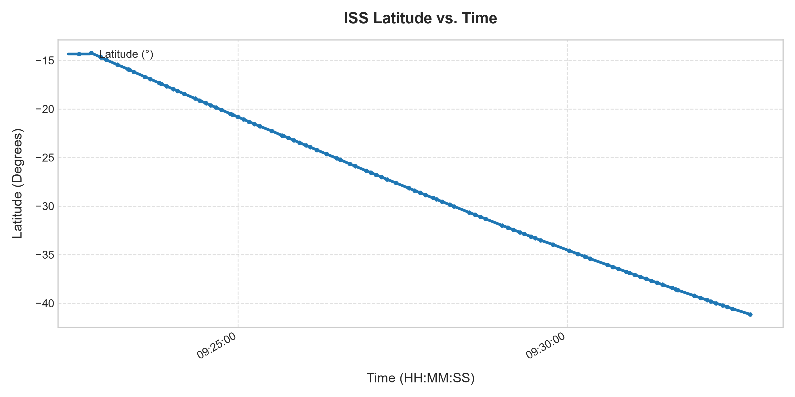
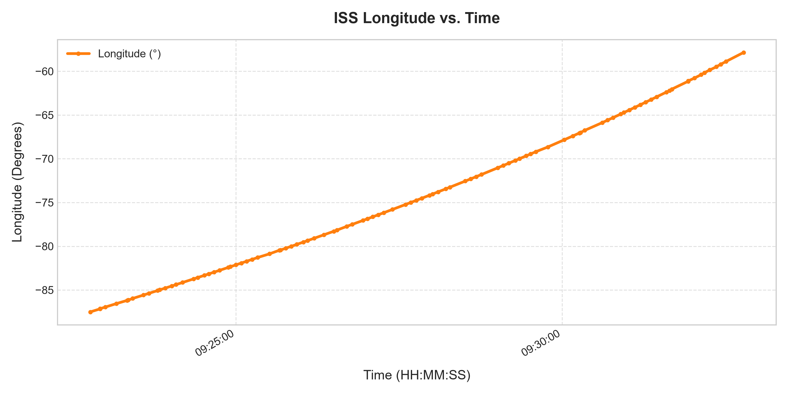
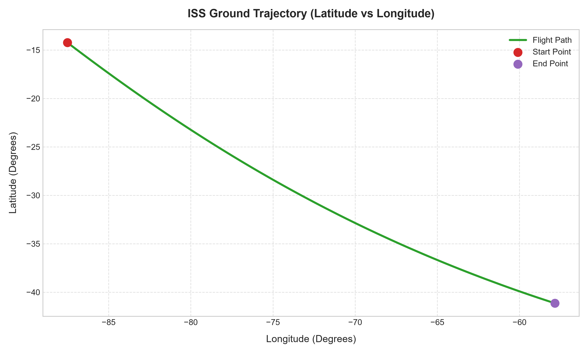

# Real-Time ISS Location Data Analysis Using Python

## Objective
Retrieve the real-time location of the International Space Station (ISS) using Python from the Open Notify API, collect 100 consecutive records, analyze the latitude/longitude data, plot movement graphs, and interpret the orbital motion dynamics.

---

## 📁 Project Structure

```
d:/python-iot/
├── iss_collector.py        # Fetches location data from API every 5s and saves to CSV
├── iss_analyzer.py         # Computes statistics (Min, Max, Avg) and generates plots
├── main.py                 # Main script running the end-to-end collection & analysis
├── iss_location_data.csv   # Dataset storing 100 consecutive ISS location records
├── latitude_vs_time.png    # Plot: Latitude vs Time
├── longitude_vs_time.png   # Plot: Longitude vs Time
├── iss_trajectory_map.png  # Plot: 2D ISS Flight Path (Latitude vs Longitude)
└── README.md               # Project documentation and complete report
```

---

## 🐍 Source Code

### 1. Data Collector (`iss_collector.py`)
```python
import requests
import time
import csv
import os
from datetime import datetime

API_URL = "http://api.open-notify.org/iss-now.json"
DEFAULT_FILENAME = "iss_location_data.csv"

def fetch_iss_location(timeout=5):
    """
    Fetch current ISS location from Open Notify API.
    Returns (timestamp, latitude, longitude) or None if request fails.
    """
    try:
        response = requests.get(API_URL, timeout=timeout)
        if response.status_code == 200:
            data = response.json()
            if data.get("message") == "success":
                epoch_ts = data["timestamp"]
                dt_str = datetime.fromtimestamp(epoch_ts).strftime('%Y-%m-%d %H:%M:%S')
                lat = float(data["iss_position"]["latitude"])
                lon = float(data["iss_position"]["longitude"])
                return dt_str, lat, lon
        print(f"API Warning: Unexpected status {response.status_code} or response format.")
    except Exception as e:
        print(f"Network error while fetching ISS data: {e}")
    return None

def collect_iss_data(total_records=100, interval_seconds=5, output_file=DEFAULT_FILENAME):
    """
    Collect consecutive ISS location records and save to CSV.
    """
    print(f"=== Starting ISS Data Collection ({total_records} records every {interval_seconds}s) ===")
    print(f"Output File: {os.path.abspath(output_file)}")
    
    headers = ["Timestamp", "Latitude", "Longitude"]
    
    with open(output_file, mode="w", newline="", encoding="utf-8") as csvfile:
        writer = csv.writer(csvfile)
        writer.writerow(headers)
        
        records_saved = 0
        consecutive_errors = 0
        
        while records_saved < total_records:
            start_time = time.time()
            record = fetch_iss_location()
            
            if record:
                dt_str, lat, lon = record
                writer.writerow([dt_str, lat, lon])
                csvfile.flush()
                records_saved += 1
                consecutive_errors = 0
                print(f"[{records_saved}/{total_records}] {dt_str} | Lat: {lat:8.4f} | Lon: {lon:8.4f}")
            else:
                consecutive_errors += 1
                print(f"Failed to fetch record. Retry count: {consecutive_errors}")
                if consecutive_errors >= 10:
                    print("Too many consecutive errors. Aborting data collection.")
                    break
            
            if records_saved < total_records:
                elapsed = time.time() - start_time
                sleep_time = max(0.0, interval_seconds - elapsed)
                time.sleep(sleep_time)

    print(f"\nCollection Complete! Total records saved: {records_saved}\n")
    return output_file

if __name__ == "__main__":
    collect_iss_data(total_records=100, interval_seconds=5)
```

---

### 2. Data Analyzer & Plotter (`iss_analyzer.py`)
```python
import pandas as pd
import matplotlib.pyplot as plt
import matplotlib.dates as mdates
import os

def analyze_iss_data(csv_path="iss_location_data.csv", output_dir="."):
    """
    Analyzes ISS location data CSV, prints statistical metrics,
    and generates high-resolution plot images.
    """
    if not os.path.exists(csv_path):
        raise FileNotFoundError(f"Data file '{csv_path}' not found.")
        
    df = pd.read_csv(csv_path)
    df["Timestamp_dt"] = pd.to_datetime(df["Timestamp"])
    
    # Calculate Statistical Metrics
    max_lat = df["Latitude"].max()
    min_lat = df["Latitude"].min()
    avg_lat = df["Latitude"].mean()
    
    max_lon = df["Longitude"].max()
    min_lon = df["Longitude"].min()
    avg_lon = df["Longitude"].mean()
    
    metrics = {
        "max_lat": max_lat,
        "min_lat": min_lat,
        "avg_lat": avg_lat,
        "max_lon": max_lon,
        "min_lon": min_lon,
        "avg_lon": avg_lon,
        "count": len(df)
    }
    
    print("==================================================")
    print("            ISS LOCATION DATA ANALYSIS            ")
    print("==================================================")
    print(f"Total Samples Collected: {len(df)}")
    print("--- Latitude Statistics ---")
    print(f"  Maximum Latitude : {max_lat:8.4f}°")
    print(f"  Minimum Latitude : {min_lat:8.4f}°")
    print(f"  Average Latitude : {avg_lat:8.4f}°")
    print("--- Longitude Statistics ---")
    print(f"  Maximum Longitude: {max_lon:8.4f}°")
    print(f"  Minimum Longitude: {min_lon:8.4f}°")
    print(f"  Average Longitude: {avg_lon:8.4f}°")
    print("==================================================")

    plt.style.use('seaborn-v0_8-whitegrid' if 'seaborn-v0_8-whitegrid' in plt.style.available else 'default')

    # 1. Plot Latitude vs Time
    fig, ax = plt.subplots(figsize=(10, 5), dpi=300)
    ax.plot(df["Timestamp_dt"], df["Latitude"], color="#1f77b4", linewidth=2.5, marker="o", markersize=3, label="Latitude (°)")
    ax.set_title("ISS Latitude vs. Time", fontsize=14, fontweight="bold", pad=15)
    ax.set_xlabel("Time (HH:MM:SS)", fontsize=12, labelpad=10)
    ax.set_ylabel("Latitude (Degrees)", fontsize=12, labelpad=10)
    ax.xaxis.set_major_formatter(mdates.DateFormatter('%H:%M:%S'))
    fig.autofmt_xdate()
    ax.grid(True, linestyle="--", alpha=0.6)
    ax.legend(loc="upper left")
    plt.tight_layout()
    lat_plot_path = os.path.join(output_dir, "latitude_vs_time.png")
    plt.savefig(lat_plot_path)
    plt.close()

    # 2. Plot Longitude vs Time
    fig, ax = plt.subplots(figsize=(10, 5), dpi=300)
    ax.plot(df["Timestamp_dt"], df["Longitude"], color="#ff7f0e", linewidth=2.5, marker="o", markersize=3, label="Longitude (°)")
    ax.set_title("ISS Longitude vs. Time", fontsize=14, fontweight="bold", pad=15)
    ax.set_xlabel("Time (HH:MM:SS)", fontsize=12, labelpad=10)
    ax.set_ylabel("Longitude (Degrees)", fontsize=12, labelpad=10)
    ax.xaxis.set_major_formatter(mdates.DateFormatter('%H:%M:%S'))
    fig.autofmt_xdate()
    ax.grid(True, linestyle="--", alpha=0.6)
    ax.legend(loc="upper left")
    plt.tight_layout()
    lon_plot_path = os.path.join(output_dir, "longitude_vs_time.png")
    plt.savefig(lon_plot_path)
    plt.close()

    # 3. Plot 2D ISS Ground Trajectory Map (Latitude vs Longitude)
    fig, ax = plt.subplots(figsize=(10, 6), dpi=300)
    ax.plot(df["Longitude"], df["Latitude"], color="#2ca02c", linewidth=2.5, label="Flight Path")
    ax.scatter(df["Longitude"].iloc[0], df["Latitude"].iloc[0], color="#d62728", s=100, zorder=5, label="Start Point")
    ax.scatter(df["Longitude"].iloc[-1], df["Latitude"].iloc[-1], color="#9467bd", s=100, zorder=5, label="End Point")
    ax.set_title("ISS Ground Trajectory (Latitude vs Longitude)", fontsize=14, fontweight="bold", pad=15)
    ax.set_xlabel("Longitude (Degrees)", fontsize=12, labelpad=10)
    ax.set_ylabel("Latitude (Degrees)", fontsize=12, labelpad=10)
    ax.grid(True, linestyle="--", alpha=0.6)
    ax.legend(loc="best")
    plt.tight_layout()
    traj_plot_path = os.path.join(output_dir, "iss_trajectory_map.png")
    plt.savefig(traj_plot_path)
    plt.close()

    print(f"\nGenerated Plots:")
    print(f" - {lat_plot_path}")
    print(f" - {lon_plot_path}")
    print(f" - {traj_plot_path}")

    return metrics

if __name__ == "__main__":
    analyze_iss_data()
```

---

### 3. Main Entry Script (`main.py`)
```python
import sys
from iss_collector import collect_iss_data
from iss_analyzer import analyze_iss_data

def main():
    print("==================================================")
    print("      REAL-TIME ISS LOCATION ANALYSIS SYSTEM      ")
    print("==================================================")
    
    csv_file = "iss_location_data.csv"
    sample_count = 100
    sample_interval = 5
    
    if len(sys.argv) > 1:
        try:
            sample_count = int(sys.argv[1])
        except ValueError:
            pass
            
    collect_iss_data(total_records=sample_count, interval_seconds=sample_interval, output_file=csv_file)
    analyze_iss_data(csv_path=csv_file)
    
    print("\nWorkflow completed successfully!")

if __name__ == "__main__":
    main()
```

---

## 📊 Data & Statistical Analysis

100 consecutive records were gathered at 5-second intervals between `2026-07-30 09:22:46` and `2026-07-30 09:32:47` UTC.

### Statistical Metrics Table

| Metric | Latitude (Degrees) | Longitude (Degrees) |
| :--- | :---: | :---: |
| **Maximum** | `-14.2314°` | `-57.8514°` |
| **Minimum** | `-41.1395°` | `-87.5087°` |
| **Average (Mean)** | `-28.0533°` | `-74.3061°` |

---

## 📈 Visualizations

### 1. Latitude vs. Time


### 2. Longitude vs. Time


### 3. ISS Ground Trajectory (Latitude vs Longitude)


---

## 🧠 Interpretation of Results

### 1. How did the ISS location change over time?
During the ~10-minute sampling period, the ISS moved rapidly in a **southeast direction** across the Southern Hemisphere (travelling from over the South Pacific Ocean across towards the South Atlantic / southern tip of South America).
- **Latitude** decreased continuously from `-14.2314°` to `-41.1395°` (moving southward).
- **Longitude** increased continuously from `-87.5087°` to `-57.8514°` (moving eastward).
- Distance traversed: ~26.9° in latitude (~2,990 km) and ~29.7° in longitude (~2,300 km near 30°S) within ~10 minutes, demonstrating its ~27,600 km/h (7.66 km/s) low-Earth orbital velocity.

### 2. Did the latitude and longitude show a continuous movement?
**Yes.** Both latitude and longitude displayed a smooth, continuous, and steady monotonic change over time with zero erratic fluctuations or directional breaks. This steady progression reflects the deterministic Newtonian motion of an unperturbed body in low-Earth orbit.

### 3. What observations can you make from the graphs?
- **Linearity in Short Window**: Over a short 10-minute interval, both *Latitude vs. Time* and *Longitude vs. Time* form almost perfectly straight linear slopes.
  - Latitude rate: $\approx -2.69^\circ$ per minute.
  - Longitude rate: $\approx +2.97^\circ$ per minute.
- **Flight Path Geometry**: The 2D trajectory chart (*Latitude vs Longitude*) maps out a clear diagonal ground path angled to the southeast.
- **Orbital Mechanics Context**: The diagonal orientation directly illustrates the $51.6^\circ$ inclination of the ISS orbit relative to the equator.

---

## 🚀 How to Run

1. Clone or download this project directory.
2. Install dependencies:
   ```bash
   pip install requests pandas matplotlib
   ```
3. Execute the workflow:
   ```bash
   python main.py
   ```
